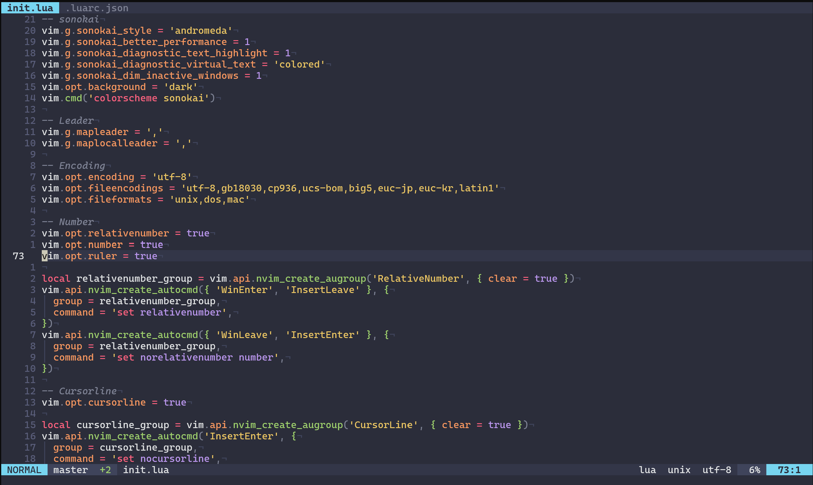

# monkey-nvim

其他语言版本：[English](README.md)

## 简介

monkey-nvim项目，旨在基于 Neovim 打造一个强大、快速的纯终端原生 IDE。

**定位：** monkey-nvim 面向纯终端环境。适用环境：

| 环境       | 说明                                                                               |
| ---------- | ---------------------------------------------------------------------------------- |
| Linux 终端 | xterm, kitty, alacritty, wezterm, gnome-terminal 等                                |
| macOS 终端 | Terminal.app, iTerm2, kitty 等                                                     |
| WSL        | Windows Subsystem for Linux（推荐 WSL2）                                           |
| 服务器 TTY | 原生 Linux 控制台（tty1–tty63），回退到内置 unokai 8/16 色（sonokai 需要 ≥256 色） |
| kmscon     | Kernel Mode Setting 控制台 —— 支持真彩色和 Unicode 的现代 TTY 替代方案             |

多会话/多终端这类顶层工作区管理交给 tmux 或终端模拟器的标签页；编辑器内的分屏和标签页照常使用。

## 截图



## 要求

- Neovim 0.12+

## 安装步骤

### 1. clone到本地

```bash
git clone https://github.com/QMonkey/monkey-nvim.git
```

### 2. 安装依赖

#### 2.1 通用工具

| 工具                                                          | 用途                                                                  | 是否必须       |
| ------------------------------------------------------------- | --------------------------------------------------------------------- | -------------- |
| git                                                           | 通过 `vim.pack` 管理插件                                              | 是             |
| [ripgrep (rg)](https://github.com/BurntSushi/ripgrep)         | fzf-lua live grep 后端                                                | 是             |
| [fzf](https://github.com/junegunn/fzf)                        | fzf-lua 模糊查找后端                                                  | 是             |
| universal-ctags                                               | gutentags 标签生成                                                    | 是             |
| [GNU Global](https://www.gnu.org/software/global/) (`global`) | gutentags gtags（GTAGS）生成与导航                                    | 推荐           |
| [Pygments](https://pygments.org/)                             | 非 C/C++ 语言的 gtags 解析器                                          | 推荐           |
| C 编译器 (gcc/clang)                                          | 编译 tree-sitter parser 原生模块                                      | 是（仅编译时） |
| [tree-sitter-cli](https://github.com/tree-sitter/tree-sitter) | 编译 tree-sitter parser 模块                                          | 是（仅编译时） |
| [Homebrew](https://brew.sh/)                                  | 系统仓库缺失时的后备包管理器（lua-language-server、marksman、fzf 等） | 必须           |

```bash
# 安装 Homebrew（所有 Linux 发行版 — 用于安装系统仓库中缺失的工具）
/bin/bash -c "$(curl -fsSL https://raw.githubusercontent.com/Homebrew/install/HEAD/install.sh)"
eval "$(/home/linuxbrew/.linuxbrew/bin/brew shellenv)"

# Ubuntu/Debian
sudo apt-get install git ripgrep fzf universal-ctags global python3-pygments gcc nodejs npm
# tree-sitter-cli 通过 npm 安装：
npm install -g tree-sitter-cli
brew install fzf

# OpenSUSE
sudo zypper install git ripgrep fzf universal-ctags global python3-Pygments gcc nodejs npm
# tree-sitter-cli 通过 npm 安装：
npm install -g tree-sitter-cli

# CentOS（需先启用 EPEL 仓库以获取 ripgrep/fzf/universal-ctags）
sudo dnf install epel-release
sudo dnf install git ripgrep fzf universal-ctags global global-ctags python3-pygments gcc nodejs npm
# tree-sitter-cli 通过 npm 安装：
npm install -g tree-sitter-cli

# Arch Linux
sudo pacman -S git ripgrep fzf ctags global python-pygments gcc nodejs npm
# tree-sitter-cli 通过 npm 安装：
npm install -g tree-sitter-cli

# macOS
brew install git ripgrep fzf universal-ctags global pygments gcc node
# tree-sitter-cli 通过 npm 安装：
npm install -g tree-sitter-cli
```

#### 2.2 LSP 服务器

monkey-nvim 使用 Neovim 内建的 LSP 客户端（`vim.lsp.config`）。请根据需要安装对应语言的服务器：

| 语言       | LSP 服务器                  | 安装方式                                                                                                                                        |
| ---------- | --------------------------- | ----------------------------------------------------------------------------------------------------------------------------------------------- |
| C/C++      | clangd                      | `sudo apt-get install clangd`、`sudo zypper install clang`、`sudo dnf install clang-tools-extra`、`sudo pacman -S clang` 或 `brew install llvm` |
| Go         | gopls                       | `go install golang.org/x/tools/gopls@latest`                                                                                                    |
| Python     | python-lsp-server           | `pip3 install python-lsp-server`                                                                                                                |
| Zig        | zls                         | `brew install zls`（推荐，保持 zig/zls 版本一致）或从 <https://zigtools.org/zls/install/> 下载                                                  |
| Rust       | rust-analyzer               | `rustup component add rust-analyzer`                                                                                                            |
| Lua        | lua-language-server         | `brew install lua-language-server` 或 `sudo pacman -S lua-language-server`                                                                      |
| Shell      | bash-language-server        | `npm install -g bash-language-server`                                                                                                           |
| Vim        | vim-language-server         | `npm install -g vim-language-server`                                                                                                            |
| JavaScript | typescript-language-server  | `npm install -g typescript-language-server typescript`                                                                                          |
| TypeScript | typescript-language-server  | `npm install -g typescript-language-server typescript`                                                                                          |
| JSON       | vscode-json-language-server | `npm install -g vscode-langservers-extracted`                                                                                                   |
| YAML       | yaml-language-server        | `npm install -g yaml-language-server`                                                                                                           |
| Markdown   | marksman                    | `brew install marksman` 或 `sudo pacman -S marksman`                                                                                            |
| Markdown   | efm-langserver              | `go install github.com/mattn/efm-langserver@latest`                                                                                             |

部分 LSP 服务器会把格式化/检查交给**外部工具**，需单独安装。缺失时功能会静默降级（回退到内置诊断或跳过该工具）：

| 语言     | 工具              | 作用                                   | 安装方式                                                                                                                                            |
| -------- | ----------------- | -------------------------------------- | --------------------------------------------------------------------------------------------------------------------------------------------------- |
| C/C++    | clang-tidy        | linter（经 `clangd --clang-tidy`）     | `sudo apt-get install clang-tidy`、`sudo zypper install clang`、`sudo dnf install clang-tools-extra`、`sudo pacman -S clang` 或 `brew install llvm` |
| Go       | staticcheck       | linter（经 `gopls` 的 `staticcheck`）  | `go install honnef.co/go/tools/cmd/staticcheck@latest`                                                                                              |
| Shell    | shfmt             | formatter（经 `bash-language-server`） | `go install mvdan.cc/sh/v3/cmd/shfmt@latest`                                                                                                        |
| Python   | black             | formatter（经 `pylsp` 的 black 插件）  | `pip3 install black`                                                                                                                                |
| Markdown | prettier          | formatter（经 `efm-langserver`）       | `npm install -g prettier`                                                                                                                           |
| Markdown | markdownlint-cli2 | linter（经 `efm-langserver`）          | `npm install -g markdownlint-cli2`                                                                                                                  |

#### 2.3 C/C++

```bash
# Ubuntu/Debian
sudo apt-get install gcc g++ clangd clang-tidy

# OpenSUSE
sudo zypper install gcc gcc-c++ clang

# CentOS
sudo dnf install gcc gcc-c++ clang clang-tools-extra

# Arch Linux
sudo pacman -S gcc clang

# macOS
brew install gcc llvm
```

#### 2.4 Go

```bash
# 请安装最新版本的 go，然后：
go install golang.org/x/tools/gopls@latest
# 可选：staticcheck 检查器（gopls 使用）
go install honnef.co/go/tools/cmd/staticcheck@latest
```

#### 2.5 Python

```bash
# 需要 Python 3（如未安装请先通过系统包管理器安装）
pip3 install python-lsp-server
# 可选：代码格式化与检查工具（black 由 pylsp 的 black 插件使用）
pip3 install black autopep8 flake8 pylint
```

#### 2.6 JavaScript / TypeScript

```bash
npm install -g typescript-language-server typescript
```

#### 2.7 Zig

Zig 的语法高亮、缩进和文件类型检测由 nvim-treesitter 提供，无需安装插件。只需安装 Zig 和 ZLS 语言服务器：

```bash
# 推荐：Homebrew 会保持 zig 与 zls 版本一致
brew install zig zls          # macOS / Linuxbrew

# 或下载版本匹配的预编译二进制：
#   zig: https://ziglang.org/download/
#   zls: https://zigtools.org/zls/install/
```

> **重要：** zls 与特定版本的 Zig 绑定，版本不匹配时会拒绝启动。请从同一来源安装 `zig` 和 `zls`（Homebrew 或官方下载工具）以保持一致。发行版软件包往往滞后：Ubuntu/Debian 稳定版没有 `zig` 包，Arch 的 `zls` 落后于 Arch 的 `zig`，通常不匹配。

保存时格式化由 ZLS 完成（与 `zig fmt` 一致），无需单独安装格式化工具。构建时诊断（`enable_build_on_save`）可在 `build.zig` 旁的 `zls.json` 中开启。

#### 2.8 Rust

```bash
# 安装 rustup（包含 rustc 和 cargo），然后：
rustup component add rust-analyzer
```

#### 2.9 YAML

```bash
npm install -g yaml-language-server
```

#### 2.10 Shell

```bash
# 安装 LSP 服务器，以及它依赖的 shfmt 格式化工具
npm install -g bash-language-server
go install mvdan.cc/sh/v3/cmd/shfmt@latest
```

#### 2.11 Markdown

终端下预览 Markdown：

```bash
# glow（终端 Markdown 渲染器）
# https://github.com/charmbracelet/glow
brew install glow       # macOS / Linuxbrew
sudo pacman -S glow     # Arch Linux
sudo apt-get install glow  # Debian 13+
go install github.com/charmbracelet/glow@latest  # Ubuntu / OpenSUSE / CentOS，或其他已安装 Go 的平台
```

格式化与检查由 [efm-langserver](https://github.com/mattn/efm-langserver) 提供（formatter: prettier，linter: markdownlint-cli2）：

```bash
go install github.com/mattn/efm-langserver@latest
npm install -g prettier markdownlint-cli2
# 将 efm 配置（config.yaml + .markdownlint.jsonc）软链到默认路径
ln -sfn $(pwd)/configs/efm-langserver ~/.config/efm-langserver
```

#### 2.12 字体（可选）

Neovim 使用的 Unicode 字符（⎇, │, ▸, ·, ¬）无需额外字体即可正常显示。如需 Powerline 风格外观，可选择性安装 [Nerd Font](https://github.com/ryanoasis/nerd-fonts)。

### 3. 健康检查

验证所有必需依赖和可选 LSP server 是否就绪：

```bash
./checkhealth.sh
```

加 `--install` 可自动安装缺失的依赖（必需工具 + 可选 LSP 服务器）。支持 apt/zypper/dnf/pacman/brew、npm、pip、go install 和 rustup：

```bash
./checkhealth.sh --install
```

也可运行 Neovim 内建的健康检查查看插件相关问题：

```bash
nvim --headless -c 'checkhealth' -c 'qa'
```

### 4. 安装

- Linux、macOS、WSL

```bash
cd monkey-nvim
ln -sf $(pwd) ~/.config/nvim
ln -sf $(pwd)/configs/.clang-format ~/.clang-format   # 全局 clang-format 风格（可选）
ln -sfn $(pwd)/configs/efm-langserver ~/.config/efm-langserver   # efm：markdown 格式化/检查（可选）
nvim --headless -c 'ZPack sync' -c 'qa'   # 安装所有插件
nvim
```

### 5. 更新

```bash
cd monkey-nvim
git pull
```

然后在 Neovim 中：

```vim
:ZPack update
```

### 6. kmscon 安装与使用（可选）

[kmscon](https://github.com/kmscon/kmscon) 是基于 Linux KMS/DRM 的系统级终端，替代传统的 Linux tty，提供完整的 Unicode 支持、multi-seat 能力和真彩色渲染。它是 monkey-nvim 在无头服务器上的绝佳搭档。

#### 6.1 安装 kmscon

```bash
# Ubuntu/Debian（旧版，不含 terminfo）
sudo apt-get install kmscon

# OpenSUSE（Tumbleweed / Leap 15.x）
sudo zypper install kmscon

# Arch Linux
sudo pacman -S kmscon

# CentOS — 官方与 EPEL 仓库均未提供，改用下方源码编译
# 从源码编译（需要 meson、ninja 和 ncurses 提供的 tic）
git clone https://github.com/kmscon/kmscon.git
cd kmscon
meson setup builddir/
meson install -C builddir/
```

从源码编译时会自动通过 `tic` 编译并安装 kmscon 的 terminfo 条目，nvim 无需任何 `TERM` 变通即可正确检测终端能力。默认安装 prefix 为 `/usr/local`，如需安装到系统路径请在 meson setup 时追加 `--prefix=/usr`。

在较旧的系统上，`libtsm` 等依赖版本可能不满足编译要求。此时使用包管理器版本并通过 6.3 节的 `TERM` 变通方案即可。

#### 6.2 用 kmscon 替代 tty（永久生效）

让 kmscon 取代传统的 tty/getty 成为默认系统控制台：

```bash
# 停止 tty1 上原有的 getty
sudo systemctl stop getty@tty1.service
sudo systemctl disable getty@tty1.service

# 为 tty1 创建 kmscon systemd 服务
sudo mkdir -p /etc/systemd/system/getty.target.wants
sudo ln -s /usr/lib/systemd/system/kmsconvt@.service \
    /etc/systemd/system/getty.target.wants/kmsconvt@tty1.service

# 覆写 ExecStart 使用 kmscon 自带的终端类型
sudo systemctl edit kmsconvt@tty1.service
```

添加以下覆写内容：

```ini
[Service]
ExecStart=
ExecStart=/usr/bin/kmscon "--vt=%I" --seats=seat0 --no-switchvt --login -- /sbin/agetty -o '-p -- \\u' - kmscon
```

最后一个参数 `kmscon` 是 agetty 的 `<termtype>` 位置参数，用于设置 `TERM=kmscon`，与编译时安装的 terminfo 条目匹配。

由于 `kmscon` 这个 terminfo 条目从 **10.0.0** 才开始随源码提供，不同版本的终端类型设置也不同：

```ini
# kmscon 10.0.0+（自带 scripts/terminfo/kmscon.ti，默认 TERM=kmscon）
ExecStart=/usr/bin/kmscon "--vt=%I" --seats=seat0 --no-switchvt --login -- /sbin/agetty -o '-p -- \\u' - kmscon

# kmscon 9.x（没有 kmscon terminfo 条目，改用 xterm-256color）
ExecStart=/usr/bin/kmscon "--vt=%I" --seats=seat0 --no-switchvt --login -- /sbin/agetty -o '-p -- \\u' - xterm-256color
```

如果你的 `agetty` 版本支持 `--noclear` 参数，可以在 `-` 之前加入它，以在登录提示符上保留 kmscon 启动画面；它纯粹是外观选项。

```bash
# 在 tty1 上启动 kmscon
sudo systemctl start kmsconvt@tty1.service
```

重启后，按 `Ctrl+Alt+F1` 即可切换到支持真彩色和 Unicode 的 kmscon 终端。可按需对 tty2–tty6 重复相同操作。

##### `start` 与 `enable` 的区别——常见坑

`systemctl start` 只是运行一次单元，完全不读取 `[Install]` 段，因此不会触碰 `autovt@.service`。`systemctl enable` 会读取 `[Install]` 并创建符号链接，包括 `Alias=autovt@.service`。

tty2–tty6 **并不**由 `getty.target.wants` 启动；systemd-logind 会把每个新激活的 VT 以 `autovt@ttyN.service` 的方式拉起，它通过 `autovt@.service` 这个别名来解析。Debian/Ubuntu 打包的 `kmsconvt@.service` 自带了该别名：

```ini
[Install]
WantedBy=getty.target
DefaultInstance=tty1
Alias=autovt@.service
```

因此：

- `systemctl enable kmsconvt@tty1.service` → 只影响 tty1（实例别名 `autovt@tty1.service`）。
- `systemctl enable kmsconvt@.service`（模板，不带 ttyN）→ **所有 VT**，因为它会创建 `/etc/systemd/system/autovt@.service -> kmsconvt@.service`。

上面的 `ln -s ... kmsconvt@tty1.service` + `start` 流程因此只作用于 tty1。如果发现 tty2–tty6 意外也变成了 kmscon，请检查残留的别名（回退方法见 6.5 节）。

#### 6.3 真彩色支持

kmscon 支持真彩色（24-bit）。monkey-nvim 通过 `has('termguicolors')` 自动检测并使用 GUI 颜色渲染。

如果通过包管理器安装的 kmscon 版本较旧（不含 terminfo）或 terminfo 条目缺失，nvim 会报错 `E558: Terminal entry not found in terminfo`。此时在 shell 配置中添加以下内容即可：

```bash
# 添加到 shell 配置文件中（~/.bashrc、~/.zshrc 等）
export TERM=xterm-256color
export COLORTERM=truecolor
```

`COLORTERM=truecolor` 必须在 `TERM=xterm-256color` 时设置，否则 nvim 无法检测到真彩色支持。注意使用 `xterm-256color` 替代 kmscon 原生 terminfo 可能导致一定的终端刷新异常。如需最佳体验，请从源码（10.0.0+）编译获取原生 terminfo 条目。

如果在 kmscon 中使用 tmux，tmux 会把 `$TERM` 覆盖为 `tmux` / `tmux-256color`。这是正常且正确的行为——**不要**改回去。tmux 会根据外层终端生成自己的内部 `TERM` 并对外暴露准确的能力，nvim 等 ncurses 程序因此能正确工作。只有**外层**（进入 tmux 之前）的 `$TERM` 才重要：10.0.0+ 保持 `kmscon`，9.x 保持 `xterm-256color`。

Linux 原生控制台（tty1–tty63，`TERM=linux`）只提供 8/16 色（`&t_Co < 256`），这会触发 sonokai 的守卫条件（`&t_Co < 256 -> finish`），从而保留内置的 8/16 色高亮，保证代码仍可阅读。sonokai 本身并不要求真彩色——在任何 256 色终端上都能通过 `cterm` 调色板正常渲染——但它在可用颜色少于 256 时会拒绝加载。monkey-nvim 因此在裸 tty 上回退到内置的 `unokai` 主题。如需在物理控制台上获得完整的 sonokai 配色，请用 kmscon 替代 tty（见 6.2 节）或改用任意 256 色/真彩色终端。

如果在裸 tty（非 kmscon）上运行 tmux，tmux 默认 `default-terminal=tmux-256color`，会向其中的所有程序宣称「256 色 + xterm 风格键序列」——即便底层控制台只有 8/16 色。monkey-nvim 已经能识别这种情况（它向上遍历进程树，看到 tmux 客户端背后的真实 tty），并回退到内置高亮，因此 nvim 自身始终正确。但其他程序没有这层保护，可能输出控制台无法显示的 256 色转义序列。要让它们也正确，把 tmux 的终端类型设为与 8 色控制台匹配：

```bash
# 写入 ~/.tmux.conf —— 仅适用于在裸 Linux tty 上运行的 tmux
set -g default-terminal "tmux"
set -g terminal-overrides ",linux:colors=16"
```

第一行让 tmux 向程序宣称普通的 8 色终端；第二行告诉 tmux 底层 `linux` 控制台有 16 色（8 基础色 + 8 亮色），使其能合理降级。**不要**在 kmscon 或普通终端模拟器下运行 tmux 时添加这两行——那些场景 `tmux-256color` 才是正确的。

#### 6.4 字体（可选）

kmscon 使用系统内建的字体渲染器。如需 Powerline 风格图标，安装任意系统等宽字体即可。

#### 6.5 回退到传统 tty/getty

将虚拟控制台交还给 agetty：

```bash
# 停止 kmscon 实例
sudo systemctl stop kmsconvt@tty1.service

# 删除 6.2 节创建的 tty1 wants 链接
sudo rm -f /etc/systemd/system/getty.target.wants/kmsconvt@tty1.service

# 在 tty1 上恢复 getty
sudo systemctl enable getty@tty1.service
sudo systemctl start getty@tty1.service
```

如果之前执行过 `systemctl enable kmsconvt@.service`（模板），`autovt@.service` 别名现在指向 kmscon，会继续替换所有 VT。需要显式回退：

```bash
# 让 autovt@.service 指回 getty（去掉 kmscon 别名）
sudo systemctl disable kmsconvt@.service
sudo rm -f /etc/systemd/system/autovt@.service

# 重新启用 getty（同时恢复 getty@tty1.service）
sudo systemctl enable getty@.service

# 重新加载，让 logind 对新激活的 VT 生效
sudo systemctl daemon-reload
```

验证别名已指回 getty：

```bash
readlink -f /etc/systemd/system/autovt@.service /usr/lib/systemd/system/autovt@.service
```

应解析到 `getty@.service`。

## 插件列表

| 插件                                                                                    | 用途                                   |
| --------------------------------------------------------------------------------------- | -------------------------------------- |
| [zuqini/zpack.nvim](https://github.com/zuqini/zpack.nvim)                               | 基于内置 `vim.pack` 的懒加载插件管理器 |
| [sainnhe/sonokai](https://github.com/sainnhe/sonokai)                                   | 配色方案                               |
| [nvim-lualine/lualine.nvim](https://github.com/nvim-lualine/lualine.nvim)               | 状态栏                                 |
| [echasnovski/mini.indentscope](https://github.com/echasnovski/mini.indentscope)         | 缩进参考线                             |
| [echasnovski/mini.extra](https://github.com/echasnovski/mini.extra)                     | mini.nvim 扩展模块（ai 规格）          |
| [echasnovski/mini.ai](https://github.com/echasnovski/mini.ai)                           | 文本对象                               |
| [echasnovski/mini.surround](https://github.com/echasnovski/mini.surround)               | 围绕字符编辑                           |
| [numToStr/Comment.nvim](https://github.com/numToStr/Comment.nvim)                       | 注释切换                               |
| [andymass/vim-matchup](https://github.com/andymass/vim-matchup)                         | 扩展 % 跳转配对                        |
| [windwp/nvim-autopairs](https://github.com/windwp/nvim-autopairs)                       | 自动配对括号                           |
| [gbprod/substitute.nvim](https://github.com/gbprod/substitute.nvim)                     | 使用剪贴板替换                         |
| [chentoast/marks.nvim](https://github.com/chentoast/marks.nvim)                         | 可视化书签                             |
| [ibhagwan/fzf-lua](https://github.com/ibhagwan/fzf-lua)                                 | 模糊文件/缓冲/tag 查找                 |
| [folke/flash.nvim](https://github.com/folke/flash.nvim)                                 | 快速跳转                               |
| [kevinhwang91/nvim-ufo](https://github.com/kevinhwang91/nvim-ufo)                       | 折叠                                   |
| [kevinhwang91/promise-async](https://github.com/kevinhwang91/promise-async)             | 异步库（ufo 依赖）                     |
| [nvim-treesitter/nvim-treesitter](https://github.com/nvim-treesitter/nvim-treesitter)   | 语法高亮与解析                         |
| [hrsh7th/nvim-cmp](https://github.com/hrsh7th/nvim-cmp)                                 | 补全引擎                               |
| [hrsh7th/cmp-nvim-lsp](https://github.com/hrsh7th/cmp-nvim-lsp)                         | LSP 补全源                             |
| [hrsh7th/cmp-buffer](https://github.com/hrsh7th/cmp-buffer)                             | 缓冲区补全源                           |
| [hrsh7th/cmp-path](https://github.com/hrsh7th/cmp-path)                                 | 路径补全源                             |
| [hrsh7th/cmp-cmdline](https://github.com/hrsh7th/cmp-cmdline)                           | 命令行补全                             |
| [saadparwaiz1/cmp_luasnip](https://github.com/saadparwaiz1/cmp_luasnip)                 | Luasnip 补全源                         |
| [L3MON4D3/LuaSnip](https://github.com/L3MON4D3/LuaSnip)                                 | 代码片段引擎                           |
| [rafamadriz/friendly-snippets](https://github.com/rafamadriz/friendly-snippets)         | 常用代码片段集合                       |
| [lewis6991/gitsigns.nvim](https://github.com/lewis6991/gitsigns.nvim)                   | Git 差异标记                           |
| [NeogitOrg/neogit](https://github.com/NeogitOrg/neogit)                                 | Git 集成                               |
| [esmuellert/codediff.nvim](https://github.com/esmuellert/codediff.nvim)                 | 并排差异对比                           |
| [rmagatti/auto-session](https://github.com/rmagatti/auto-session)                       | Session 管理                           |
| [stevearc/oil.nvim](https://github.com/stevearc/oil.nvim)                               | 文件管理器（替代 netrw）               |
| [ludovicchabant/vim-gutentags](https://github.com/ludovicchabant/vim-gutentags)         | 自动生成 ctags                         |
| [dhananjaylatkar/cscope_maps.nvim](https://github.com/dhananjaylatkar/cscope_maps.nvim) | Cscope 集成                            |
| [folke/trouble.nvim](https://github.com/folke/trouble.nvim)                             | 诊断/quickfix 列表                     |
| [jake-stewart/multicursor.nvim](https://github.com/jake-stewart/multicursor.nvim)       | 多光标编辑                             |
| [akinsho/toggleterm.nvim](https://github.com/akinsho/toggleterm.nvim)                   | 终端切换                               |

## 快捷键

```text
以下所有"Leader"键，都代表","键
```

### 1. 正常模式

#### 1.1 按键修改

```text
x       用剪贴板的内容替换文本对象选中的字符串（详见§1.6）
X       用剪贴板的内容替换当前光标到行尾的文本（详见§1.6）
Y       复制到行尾，相当于"y$"命令
H       跳到当前行第一个非空字符,相当于"^"命令
L       跳到当前行最后一个字符,相当于"$"命令
U       Redo，相当于"Ctrl-r"
;       进入命令行模式，相当于":"键
q       退出窗口（含 diff/git/quickfix 特殊处理）
Shift+q  退出vim，相当于命令":qa"
t       记录操作，相当于原来的q（普通模式和可视化模式）

j       移至下一显示行（gj），在折行中正常移动
k       移至上一显示行（gk），在折行中正常移动
f       搜索 1 个字符跳转（flash.nvim 带提示）
F       搜索字符并聚焦到匹配末尾（flash.nvim）
```

以下按键在插入模式和命令行模式下均适用：

```text
Ctrl+p  上移        (Up)
Ctrl+n  下移        (Down)
Ctrl+b  左移        (Left)
Ctrl+f  右移        (Right)
Ctrl+a  跳到行首    (Home)
Ctrl+e  跳到行尾    (End)
Ctrl+h  退格        (BackSpace)
Ctrl+d  向前删除    (Del)
```

#### 1.2 F1 ~ F4

```text
F1      打开 fzf-lua live grep
F2      切换 fzf-lua 恢复/关闭
F3      在终端中运行一次性命令
F4      切换终端窗口（打开/隐藏）
```

使用 `<Ctrl-\><Ctrl-n>` 从终端模式切换到普通模式。普通模式下 `<ScrollWheelUp>` 和 `<ScrollWheelDown>` 可滚动终端缓冲区。

#### 1.3 缓冲

```text
Leader+o    输入打开文件的路径，并在当前窗口打开一个缓冲
[+b         切换到上一个缓冲
]+b         切换到下一个缓冲
```

#### 1.4 分屏

```text
Leader+Leader+s    输入打开文件的路径，并创建一个水平分屏的窗口
Leader+Leader+v    输入打开文件的路径，并创建一个垂直分屏的窗口

Ctrl+h      跳转到左窗口
Ctrl+j      跳转到下窗口
Ctrl+k      跳转到上窗口
Ctrl+l      跳转到右窗口
Leader+z    窗口放大/恢复
```

#### 1.5 Tab

```text
Leader+Leader+t      输入打开的文件路径，并创建一个新tab窗口

[+t         切换到上一个tab窗口
]+t         切换到下一个tab窗口
Leader+1~9  切换到第1~9个tab窗口
Leader+[    切换到第一个tab窗口
Leader+]    切换到最后一个tab窗口
```

#### 1.6 替换（substitute.nvim）

```text
x{文本对象}  用剪贴板内容替换一个文本对象（如 xiw 替换当前词）
xx          用剪贴板内容替换当前整行
X           用剪贴板内容替换从光标到行尾
```

#### 1.7 LSP（Language Server Protocol）

```text
K (gh)             查看光标所在符号的文档说明（LSP 文件类型）
K                   其他文件类型使用 `:Man`，Vim/help 文件使用 `:help`

gd                 跳转到定义（无 LSP 时回退到标签跳转）
gc                 跳转到声明
gt                 跳转到类型定义
gi                 跳转到实现（结果在 trouble 中）
gr                 查看引用（结果在 trouble 中）

Leader+rn          重命名符号
[d                 上一个诊断
]d                 下一个诊断
[D                 第一个诊断
]D                 最后一个诊断
Leader+d           切换诊断列表（trouble）
```

文件在保存时自动通过 LSP 格式化。自动补全默认开启 — LSP 建议会自动弹出。

#### 1.8 文件/缓冲/Tag 导航（fzf-lua）

```text
Ctrl+p      搜索文件

Leader+b    搜索缓冲
Leader+t    搜索当前文件Tag
Leader+p    搜索项目Tag
Leader+f    搜索当前文件函数
Leader+e    搜索当前文件行
Leader+a    当前目录搜索光标所在的词
```

#### 1.9 折叠（nvim-ufo）

```text
za      当光标下的折叠打开时，关闭它。当折叠关闭时，打开它
zc      关闭光标下的折叠
zo      打开光标下的折叠
zR      打开所有折叠
zM      关闭所有折叠
```

#### 1.10 Marks（marks.nvim）

```text
m[a-zA-Z]   添加/删除标记
m,          添加下一个可用的标记
m.          如果当前行没有标记，添加下一个可用标记。否则，删除第一个标记

dm[a-zA-Z]  删除标记[a-zA-Z]
m-          删除当前行的所有标记
m<Space>    删除当前buffer的所有标记

'[a-zA-Z]   跳转到标记[a-zA-Z]
]` / [`     跳转到下一个 / 上一个标记
`] / `[     根据字母顺序跳转到下一个 / 上一个标记
m/          在Location List里，查看当前buffer的所有标记
```

#### 1.11 Oil（文件管理器，替代netrw）

```text
-           在当前窗口打开文件所在的文件夹
~           在当前窗口打开项目根路径或用户主目录

<CR>        进入目录或打开文件
-           返回上一级目录
```

#### 1.12 终端

```text
F3      在终端中运行一次性命令
F4      切换终端窗口（打开/隐藏）
```

使用 `<Ctrl-\><Ctrl-n>` 从终端模式切换到普通模式。普通模式下 `<ScrollWheelUp>` 和 `<ScrollWheelDown>` 可滚动终端缓冲区。

#### 1.13 围绕字符编辑（mini.surround）

```text
sa+textobj+surroundA        在textobj指定的范围增A围绕字符
sd+surroundA                删除A围绕字符（2sd" 删除第2层嵌套）
sr+surroundA+surroundB      将A围绕字符改成B围绕字符
```

#### 1.14 操作符（Operators）

操作符与文本对象（§1.15）或 motion 组合使用：`{操作符}{文本对象}`。以下操作符均支持 `[count]`。

```text
# Vim 原生
d c y           删除 / 修改 / 复制
gu gU g~        转小写 / 转大写 / 大小写互换
> <             缩进调整
=               按缩进规则重排
!               通过外部命令过滤行
gn gN           操作下一个 / 上一个搜索匹配
gc              注释开关（Comment.nvim）

# substitute.nvim（见 §1.6）
x               用寄存器内容替换文本对象 / motion
xx              替换当前整行
X               替换光标到行尾

# mini.surround（见 §1.13）
sa{motion}{char}    增加围绕字符（2saiw 会使围绕字符翻倍）
sd{char}            删除围绕字符    [count] = 嵌套层级，如 2sd"
sr{old}{new}        替换围绕字符    [count] = 嵌套层级
```

#### 1.15 文本对象（mini.ai / vim-matchup / flash.nvim）

所有文本对象都能配合任意操作符（§1.14）使用。mini.ai 接管了 operator-pending 和 visual 模式的 `a` / `i` 前缀，等待一个标识符字符；未识别的标识符回落到原生行为。连续输入（如 visual 模式下按两次 `a(`）可逐层扩展选区。

```text
# Vim 原生（未识别的标识符自动回落）
iw aw iW aW     词 / 字串
is as ip ap     句子 / 段落
i( a( i[ a[ i{ a{ i< a<   括号
i" a" i' a' i` a`   引号
it / at         HTML/XML 标签
gn / gN         上次搜索匹配

# mini.ai（增强搜索，支持 treesitter）
( ) [ ] { } < >     平衡括号（开闭两种形式）
b               自动检测 ) ] }
" ' `           平衡引号
q               自动检测 " ' `
t               标签（平衡匹配）
f               函数调用（tree-sitter）
a               函数参数（tree-sitter）
i               缩进块：`ii` 内部 / `ai` 范围（如 dii、dai、yii）
L               行：`iL` 去缩进 / `aL` 整行（2aL 跨两行）
B               缓冲区：`aB` 全部行 / `iB` 去掉首尾空行
?               交互输入（输入两个分隔符字符）

# vim-matchup（关键词块）
i% / a%         if...endif、function...endfunction 等的内部 / 范围
2i%             第 2 层包围块的内部

# flash.nvim（treesitter 选区）
F               visual 模式：选区扩展到外层 treesitter 节点
                operator-pending 模式：对光标下的 treesitter 节点执行操作
```

各插件的 `[count]` 语义：

```text
Vim 原生        重复对象本身（2iw = 两个词）；括号类无嵌套 count
mini.ai         括号 / 引号 / 标签：count = 嵌套层级（2a( 选外一层）
                visual 模式下连续输入同样向外扩展
vim-matchup     count = 第 N 层包围块
```

自定义标识符（`i` / `L` / `B`）与 Neovim 0.13 的说明：

- 小写 `l` 不能用作标识符：mini.ai 默认的 `al` / `il` 扩展映射
  （around/inside-last，即"上一个匹配对象"）会遮蔽它。这是上游的刻意行为：
  Neovim 0.13 新增了原生 `il`/`al`，mini.ai 为向后兼容继续遮蔽。
- 0.13 原生 `il`（"inner line"）去除首部**和尾部**空白，且在空白行上直接失败；
  我们的 `iL` 只去缩进、保留尾部空白。
- 0.13 原生 `al` 是 "all lines"（整个 buffer，linewise）；我们的 `aL` 是当前行
  （charwise），整个 buffer 是 `aB`。副作用：原生 `{}` 块别名 `aB` 被遮蔽，
  请改用 `a{` / `a}`。

#### 1.16 其他

```text
Leader+ws       保存session
Leader+rs       删除session（需确认）

'.              最后一次变更的地方
''              跳回来的地方（最近两个位置跳转）
Ctrl+o          跳回，可用于多种类型跳转
Ctrl+i          继续上次跳转（与Ctrl+o操作相反）
cod             切换diff模式
cop             切换paste模式
col             切换list模式
con             清除搜索高亮
Leader+cr       切换到当前文件所在项目根路径
Leader+space        去除行尾空白字符
Leader+Leader+space  去除行尾空白字符 + \r（DOS 换行符）
Leader+q            打开/关闭quickfix（trouble）
Leader+l            打开/关闭location list（trouble）
Leader+gg           打开 Neogit
Leader+gl           打开 Neogit log（当前文件）
Leader+gL           打开 Neogit log（所有引用）
Leader+gd           Gitsigns diff this
Leader+gD           CodeDiff
Leader+gb           Gitsigns blame line
Leader+gB           Gitsigns blame
Leader+hs           Gitsigns stage hunk
Leader+hS           Gitsigns stage buffer
Leader+hr           Gitsigns reset hunk
Leader+hR           Gitsigns reset buffer
Leader+hp           Gitsigns preview hunk inline
Leader+hP           Gitsigns preview hunk
Leader+hq           Gitsigns set quickfix
Leader+hQ           Gitsigns set quickfix all
Leader+hl           Gitsigns set loclist

可视模式：
Leader+gl           对选中行打开 Neogit log

SudoWrite           使用 root 权限保存文件
```

在 quickfix/location 窗口中：

- `o`/`Enter` — 打开条目（文件+行号）
- `q` — 关闭窗口

`gdefault` 已设置，`:s` 默认执行全局替换。`jumpoptions+=stack` 使跳转列表行为类似标签栈。

Viminfo 的对应物 shada 按工程隔离：命令/搜索历史、寄存器和 file marks 保存到 `~/.local/state/nvim/shada/<工程根目录扁平化>.shada`（从启动目录向上查找 `.git`/`.root`/`.hg`/... 标记定位工程根，找不到时回退到 `~`），各工程的历史互不干扰。与 Vim 的 viminfo 不同，Neovim 的 shada 不持久化跳转列表。

#### 1.17 自动插入文件头

新建 `.sh` 和 `.py` 文件会自动插入 shebang 行：

- `.sh` → `#!/usr/bin/env bash`
- `.py` → `#!/usr/bin/env python3`

### 2. 插入模式

#### 2.1 代码片段（LuaSnip）

```text
Ctrl+l      展开/确认补全
Tab         跳转到下一个占位符
Shift+Tab   跳转到上一个占位符
```

补全快捷键：

```text
Ctrl+l      确认补全或展开/跳转代码片段
Ctrl+j      选择下一个补全项
Ctrl+k      选择上一个补全项
CR          确认补全（选择当前选中项）
```

### 3. 可视化模式

#### 3.1 按键修改

```text
s       用剪贴板的内容替换选中文本
;       进入命令行模式，相当于":"键
<       减少缩进，保持选中
>       增加缩进，保持选中
```

#### 3.2 查找

```text
Leader+a        当前目录搜索选中字符串（fzf-lua）
```

#### 3.3 替换

```text
x{文本对象}  用剪贴板内容替换文本对象（如 xiw）
xx          用剪贴板内容替换当前整行
X           用剪贴板内容替换光标到行尾
```

#### 3.4 快速跳转（flash.nvim）

```text
f           搜索1个字符并跳转（flash.nvim）
F           基于 treesitter 的选区（visual 扩展选区 / operator-pending 选中节点）
```

#### 3.5 围绕字符编辑（mini.surround）

```text
sa+surroundA     选中字符串增加A围绕字符（2sa 使围绕字符翻倍）
```

### 4. 命令行模式

```text
Ctrl+p  上一条命令
Ctrl+n  下一条命令
Ctrl+a  跳到命令行最前
Ctrl+e  跳到命令行最后
```

## 常用命令

### 1. SudoWrite

```vim
" 使用 root 权限保存文件
:SudoWrite
```

### 2. fzf-lua

```vim
" 搜索文件
:FzfLua files

" 搜索缓冲区
:FzfLua buffers

" 实时搜索
:FzfLua live_grep

" 搜索 help 标签
:FzfLua help_tags

" 恢复上次搜索
:FzfLua resume
```

### 3. Neogit

```vim
" 打开 Neogit 状态
:Neogit

" 打开当前文件日志
:Neogit log_current

" 打开项目日志
:Neogit log
```

### 4. Gutentags

```vim
" 为当前文件生成tag
:GutentagsUpdate

" 为整个工程生成tag
:GutentagsUpdate!
```

如果安装了 GNU Global（`gtags`/`global`）和 Pygments（`pygmentize`），gutentags 会在 ctags 之外同时生成 `GTAGS`/`GRTAGS`/`GPATH` 数据库。首次 BufEnter 时自动构建 GTAGS，保存时增量更新。

Cscope 快捷键（通过 cscope_maps.nvim）：

```text
gs      查找光标下的符号（Cscope find s）
gD      跳转到定义（Cstag）
gR      查找调用者（Cscope find c）
g]      跳转到标签并打开 quickfix
```

## 在 Neovim 中使用 git

### 1. git for Neovim: [Neogit](https://github.com/NeogitOrg/neogit)

```vim
:Neogit
:Neogit log_current
:Neogit log
:Neogit pull
:Neogit push
:Neogit commit
:Neogit branch
```

### 2. Git 差异标记：[gitsigns.nvim](https://github.com/lewis6991/gitsigns.nvim)

```vim
]h / [h  跳转到下一个/上一个修改块

:Gitsigns preview_hunk
:Gitsigns stage_hunk
:Gitsigns reset_hunk

:Gitsigns setqflist
:Gitsigns setloclist
```

### 3. 并排差异对比：[codediff.nvim](https://github.com/esmuellert/codediff.nvim)

```vim
:CodeDiff
```

## 注意事项

- **缩进规则** — monkey-nvim 按文件类型应用缩进设置：

| 文件类型                                          | 风格                     | 宽度 |
| ------------------------------------------------- | ------------------------ | ---- |
| `c`, `cpp`, `go`, `sh`, `vim`, `sql`              | 硬制表符 (`noexpandtab`) | 4    |
| `zig`, `rust`, `python`, `markdown`               | 空格 (`expandtab`)       | 4    |
| `javascript`, `typescript`, `lua`, `yaml`, `json` | 空格 (`expandtab`)       | 2    |

全局默认使用 4 宽度硬制表符。

- Neovim 剪贴板集成

monkey-nvim 在检测到显示服务器时设置 `clipboard=unnamed,unnamedplus`，复制/删除操作会自动同步到系统剪贴板。

如需独立的剪贴板管理工具（可选）：

| 工具                                              | 平台      | 用途                               |
| ------------------------------------------------- | --------- | ---------------------------------- |
| [parcellite](https://parcellite.sourceforge.net/) | X11       | 轻量级剪贴板管理器，支持持久化历史 |
| [cliphist](https://github.com/sentriz/cliphist)   | Wayland   | wlroots 剪贴板历史管理             |
| 系统自带                                          | macOS/WSL | 系统剪贴板默认持久化，无需额外工具 |

> 可选 CLI 工具：`wl-clipboard`（Wayland，提供 `wl-copy`/`wl-paste`）、`xclip` 或 `xsel`（X11）。Neovim 内建剪贴板支持，这些工具仅在 Neovim 外部需要命令行剪贴板访问时使用。

## 额外设置

- 在 bashrc 中加入以下 Shell 代码，在 Neovim 中查看 man 文档：

```bash
export MANPAGER="nvim -R +MANPAGER -"
```

## 从源码编译 Neovim

获取最新版本或系统仓库中不包含的功能：

```bash
git clone https://github.com/neovim/neovim.git
cd neovim
make CMAKE_BUILD_TYPE=RelWithDebInfo
sudo make install
```
